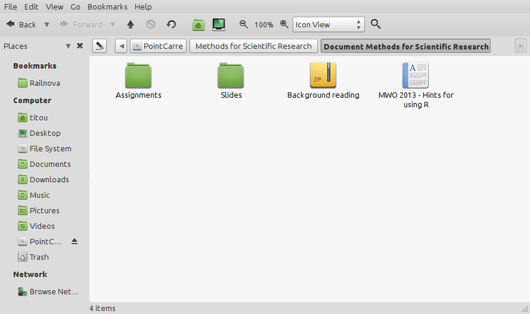

# PointCarréFS

Mount VUB's e-Learning system on your computer, and access documents on the
platform like local files !

## Examples

You access any course you subscribed to in your favorite file browser:

The filesystem looks like this:

    PointCarre/
    ├── Functional Programming
    │   └── Document Functional Programming
    │       ├── Lab Sessions
    │       │   ├── exercises01.pdf
    │       │   ├── exercises02.pdf
    │       │   ├── exercises03.pdf
    │       │   ├── exercises04.pdf
    │       │   ├── solutions01.hs
    │       │   └── solutions02.hs
    │       └── Slides
    │           ├── Black&White
    │           │   ├── Chapter 0
    │           │   ├── Chapter 1
    │           │   ├── Chapter 2
    │           │   ├── Chapter 3
    │           │   ├── Chapter 4
    │           │   └── Chapter 5
    │           └── Color
    │               ├── Chapter 0
    │               ├── Chapter 1
    │               ├── Chapter 2
    │               ├── Chapter 3
    │               ├── Chapter 4
    │               └── Chapter 5
    ├── Methods for Scientific Research
    │   └── Document Methods for Scientific Research
    │       ├── Assignments
    │       │   ├── Assignment 1 - literature review
    │       │   └── Assignment 2 - proposal
    │       ├── Background reading
    │       ├── MWO 2013 - Hints for using R
    │       └── Slides
    │           ├── Slides Experimental Design
    │           ├── Slides introduction
    │           └── Slides referencing and literature
    ...

## Usage
### Installation

Ensure you have Python2 and virtualenv on your computer, and the fuse library
development files (`sudo apt-get install python python-virtualenv libfuse-dev`
on Debian boxes)

    git clone <this repo>
    virtualenv ve
    source ve/bin/activate
    pip install -r requirements.txt

### Mount the filesystem
#### Provide your netid/password (needed to connect to PointCarre)

    echo 'NETID = "<your netid>"' > local_config.py
    echo 'PASSWORD = "<your password>"' >> local_config.py

    mkdir PointCarre
    python fs.py PointCarre

## How it works

This program actually makes the HTTP queries you would do in a web browser to
provide the files through a Filesystem in USErspace (FUSE). Once a remote
resource (directory or file) has been fetched, it is cached in order to speedup
subsequent accesses.

## Still TODO

* Better handling of files without extension (infere type from icon, other resource page, ...)
* Faster
* Include other section than documents (news ?)
* Better error handling
